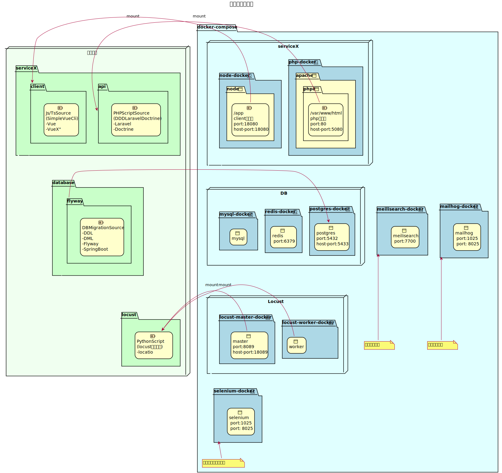

# MultipleLaravelPrj
### (MultipleWebIntegrationDevelopment)
複数のWebアプリを開発するための統合開発リポジトリです。
Webアプリはクライアントとサーバサイドを完全に分離するような思想になっています。  
この環境上サーバサイド(以下API)は

    言語:PHP 
    FW:Laravel
    ORM:Doctrine

クライアントサイド(以下CLI)は
    
    言語：Javascript,TypeScript,Html
    FW(Lib):Vue

にてWebアプリを構成していきます。  
※以下このセットをWebServiceと呼びます  
用意したシェルコマンドを実行することで上記の新たな構成を自動で作製し、   
比較的用意にWebServiceの追加を行うことができるような物を目指しています。

サーバサイドはPHP,Laravelを使用していますが、今後別の言語セットで同等の  
開発環境を作製していくつもりです。  
取り急ぎは、Web開発時に選択されやすいPHPをターゲットとしていますが、   
あえてPHPという言語の特性を極力排除した作り(Javaライクな実装ができるような)  
をしており、今後他の言語でも同様の機能をもった基盤を作製していくつもりです。

## 大まかな技術スタック
主要な技術を本PJ内に予め用意している開発ソースとの関連性を明記した図を添付します。   
基本的には複数のサーバをdockerで再現させており、docker-composeにより包括的に管理しています。  
よってホスト側にて各dockerコンテナよりforwardされたportを使用し開発してください。  
windowsの場合vagrant環境にも同様の設定が必要ですが、同梱しているvagrantFile内で初期導入時には即座に使える状態にしています。  

## Submoduleに関して
様々なロケーションでの活用を想定して、DBに関するリポジトリなどを分離しています。
git submoduleにて実現していますが、基本的には単一リポジトリが望ましいのは間違いないため。
必要に応じてサブモジュール管理からすべてを本体で一括のソース管理へ移行いただくとよいかと思います。

# SetUp
## git clone
まずはこのPJをGitClone、または一括でDLしてください
### cloneの場合 
	git clone --recursive https://github.com/yuichi-sano/multiple-laravel-prj.git  
	# 他のPJで使う場合は下記のようにgit管理を削除
	rm -rf .git

#### すでにPJをcloneしている場合
下記のようにサブモジュールを更新

    git submodule update --init "database"

### DLの場合
	wget https://github.com/yuichi-sano/multiple-laravel-prj/archive/refs/heads/develop.zip
	unzip develop.zip

## ForWindows
### [Windows環境でのSETUP](./docs/for_win/README.md)  
本資料では、vagrantに関する記述は上記に留めます  
vagrantにて仮想環境が起動したら、ssh接続を実施し  

	cd /home/apps/service1/api/
	sh ./setup_scripts/setup.sh local service1 localhost
を実行ください。
## ForMac
本PJに同梱されるシェルではrealpathコマンドを使用しています。  
macでは下記パッケージが必要なのでinstallします。
    brew install bash
    brew install coreutils
上記は主にbundle-sailというスクリプト実行に必要です。  
インストールが完了次第後続の手順へ進んでください

	cd service1/api/
	sh ./setup_scripts/setup.sh local service1 localhost
を実行ください。

### setup.shについて
    第一引数: 環境を入力。local,staging,productの3種類を想定しています。
    第二引数: サービス名称を入力、dockerのコンテナ名にはねます
    第三引数: URL,開発時点ではlocalhostを指定しておけば問題ないです。

## BundleSailの実行
laravel公式が提供しているsailを少しだけ拡張しています。  
複数のsailプロジェクトを同時に扱うためのコマンドを用意しており、それを本PJでは

    bundle-sail
と呼んでいます。
下記手順にて実行します。
リポジトリのTOPディレクトリまで移動します。

	cd {このREADME.mdのpath}
	./bin/bundle-sail up -d 

にてアプリケーションが起動します。
### BundleSailコマンドを登録
    sudo ln -s /home/apps/bin/bundle-sail /usr/bin/bundle-sail
などで登録しておくとよいと思います。  
※場所を選ばずに実行可能なスクリプトにしております。

### DBのSETUP
下記コマンドにてローカル環境のDBをマグレーションします 
## 既存でDBが存在し、マスターデータ等のダンプリストアを挟みながらマイグレーションする場合
    bundle-sail service1 artisan flyway:initMigration
    bundle-sail exec  -e PGOPTIONS="-c encrypt.enable=off" postgres  pg_restore -v  -U sample -a -d sample /var/dump_datas/dumps.custom
    bundle-sail service1 artisan flyway:develop

## 完全新規の場合
    bundle-sail service1 artisan flyway:develop

### DBの完全な洗い替え
    bundle-sail down
    docker rmi apps_postgres
    docker volume rm postgres-data
    docker volume create postgres-data
    bundle-sail up -d
    ### 上述の既存または新規の場合のmigrationコマンド
    bundle-sail service1 artisan flyway:initMigration
    bundle-sail exec  -e PGOPTIONS="-c encrypt.enable=off" postgres  pg_restore -v  -U sample -a -d sample /var/dump_datas/dumps.custom
    bundle-sail service1 artisan flyway:develop

### 確認

初期設定のserviceの起動が完了すると

http://localhost:18080/

からclient画面を確認できます。  
またlaravelアプリは下記で動作します。

http://localhost:5080/

# WebServiceの追加
初期ではservice1というWebアプリケーションセットのみが構成されていますが。  
よくある構成として

    公開用Webアプリ
    管理用Webアプリ
等といったターゲット途なるユーザーが別のWebアプリケーションを開発する必要がある場合が多くあります。  
そのような場合のWebServiceを追加するパターンについて言及します。  
bundle-sail に追加用のスクリプトを用意しています。

	bundle-sail add_service [サービス名] [環境] [URL]

上記を実施すると、service1のほかに指定したサービス名にて同様の構成が作成されます。 

※https://github.com/yuichi-sano/ddd-laravel-doctrine

とほぼ同等のソースが配置され,setupも完了した状態になります。
### bundle-sailの引数について
    第一引数: サービス名称を入力、dockerのコンテナ名にはねます
    第二引数: 環境を入力。local,staging,productの3種類を想定しています。
    第三引数: URL,開発時点ではlocalhostを指定しておけば問題ないです。

※setup.shと第一、第二の引数順番が逆ですのでご注意ください。

## TODO 
サービス追加時には
	docker-compose.yml
	bundle.env
には現状手動で追記が必要です。それぞれ追加したアプリケーション名にそって記述を追加します。

※上記ファイルそれぞれのservice1に関する記述を模倣するとよいです。

    bundle-sail up -d 
にてアプリケーションが起動します。  
アプリが起動したらServiceの追加が完了です。

# TIPS 
サービス追加時

	https://github.com/yuichi-sano/ddd-laravel-doctrine
のソースコードを落としてきます。  
その後、各種設定を行ったのち

	.git
	Vagrantfile
	./database/flyway   
を削除します。  

    ./database/flyway   
に関してはmulti構成の場合はservice個別に集中データベースのマグレーション管理  
をしだすと最終的に管理しきれなくなることが考えられるためです。  
また、docker-composeを下記のように書き換えます、  

	./docker-compose.yml [指定したサービス名].yml  

このymlを参考に、本PJが参照するdocker-composeへ追記していくとよいと思います。  

# DB
本PJにて同梱しているDB環境はdockerで構成されています。
またflywayというmigrationツールを利用しています。
セットアップ自体は

    setup.sh  
と  

    bundle-sail up -d

にて完了しますが、個別の設定や、flywayに関する操作方法を下記に記載します。
### [DBセットアップ及びmigration操作](./database/flyway/README.md)

# Api
本PJにて同梱しているAPIについてのdocumentを下記に記載します。  
※初期導入時に同梱されるservice1というdirectoryのドキュメントを参照します。
### [APIに関して](./service1/api/README.md)

# Client
本PJにて同梱しているCLIについてのdocumentを下記に記載します。   
※初期導入時に同梱されるservice1というdirectoryのドキュメントを参照します。
### [CLIENTに関して](./service1/client/README.md)

# Commit, Push
databaseはサブモジュール管理となっています、
変更のコミット・プッシュは下記要領で行います。

1. ### PJの変更状況確認
    Git Bashなどで次のコマンドを実行します。

        cd {このREADME.mdのpath}
        git status
    次のような結果が出力される場合、databaseに変更があるためサブモジュールへのコミット・プッシュが必要となります。

            modified:   database (modified content)

    ### サブモジュールへのコミット・プッシュ
    1. #### サブモジュールのディレクトリへ移動
            cd {このREADME.mdのpath}/database
        ※サブモジュールの変更状況を確認したい場合、このタイミングでも以下のコマンドを実施してください。

            git status

    1. #### サブモジュールへのコミット
        通常のコミットコマンドでコミットがおこなえます。  
        以下に一例を記載しますが、お好みの手順でコミットを実施してください。

            git add {変更対象のファイル名}
            git commit -m "{コミットコメント}"
    1. #### サブモジュールへのプッシュ
            git push origin {ブランチ名}
    1. #### メインのPJへ再移動
            cd ..
    1. #### PJの変更状況を再確認
            git status

1. ### メインのPJへのコミット
    以下に一例を記載します。  
    git add時にサブモジュールを指定する以外特筆事項はないため、サブモジュール同様お好みの手順でコミットを実施してください。

        git add "database"( {メインのPJのコミット対象ファイル})
        git commit -m "{comment}"

1. ### メインのPJへのプッシュ
        git push origin {ブランチ名}

# 実装時使用コマンド参考
### クラスの再読み込み
最新ソースpull時などに実行

    bundle-sail service1 composer dump-autoload

### PHP UNITのテスト実行
    bundle-sail service1 artisan test

