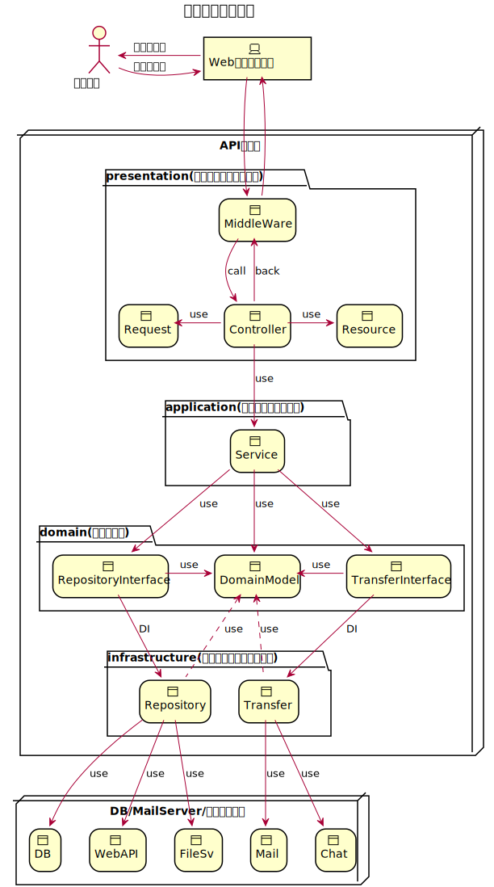

# DDD-Laravel-Doctrine

# SetUp
## git clone
まずはこのPJをGitClone、または一括でDLしてください
### cloneの場合 
	git clone https://github.com/yuichi-sano/ddd-laravel-doctrine.git  
	# 他のPJで使う場合は下記のようにgit管理を削除
	rm -rf .git

### DLの場合
	wget https://github.com/yuichi-sano/ddd-laravel-doctrine/archive/refs/heads/master.zip a.zip; unzip a.zip

## ForWindows
###  [Windows環境でのSETUP](./docs/for_win/README.md)   
※本資料では、vagrantに関する記述は以上とします。  
vagrantにて仮想環境が起動したら、ssh接続を実施し
setup.shを実行ください。

    sh ./setup_scripts/setup.sh local service1 localhost
## ForMac
setup.shを実行ください。

    sh ./setup_scripts/setup.sh local service1 localhost
### setup.shについて
    第一引数: 環境を入力。local,staging,productの3種類を想定しています。
    第二引数: サービス名称を入力、dockerのコンテナ名にはねます
    第三引数: URL,開発時点ではlocalhostを指定しておけば問題ないです。

## Sailの実行

    ./vendor/bin/sail up -d
にてアプリケーションが起動します。
ここまででSETUPが完了します。

# 設計思想
Laravelを一部拡張しながらクリーンアーキテクトの思想を取り入れています。   
Laravel標準ではクリーンアーキテクトな思想に関しての言及がないので  
本ドキュメントにて、Laravelのどの機能をどう活用してクリーンアーキテクトを  
実現しているかを言及していきます。

## 設計デザイン
下記にてざっくりと設計デザインを図示します。  
  

###下記リンクにて詳細な設計思想についての言及をします。
###- [設計についての詳細](./docs/architect/designArchitect.md)
###- [主要なClass設計図](./docs/architect/classesUml.svg)

# 設定済、カスタマイズ済み
Laravelについて、packages以外で特筆すべき拡張を実施している点についての説明、解説をしていきます。

## JWT認証laravel用モジュール
    Tymon/JWT-Auth
そのままレールに従った使い方ではないが、GuardなどLaravelのうまみを消しすぎないような  
カスタマイズを実施しています。   
Tokenの作成はFactoryを介して実施することでブラックボックス化をある程度軽減させています。　　
※本PJのsampleではdefaultでJWT認証に倒しています。

## Japanese
Laravelはそのまま使うとValidationエラーのメッセージに英語を返してきたりします。   
そのままでもよいにはよいですが、日本語で定義しておいた方が理解の助けになるということで導入しています。

    日本語バリデーション等追加済み
    laravelの標準的な使い方をしています
    バリデーションや、例外メッセージ等もここで管理するといいと思います。
    TODO メール文面をどこに配置するかを要件等する。
## MiddleWare
    tokenAuth
と命名して、jwt認証ガード一式を登録しています。

## Doctrineについて
	本初期sampleではEloquentは廃止しています
	LaravelDoctorineを採用しています。
    migrationはそもそもlaravelの機能をつかっていません。
	migrationについては後述します。
    本PJではxmlマッピング形式を利用しさらに
    NamedNativeQueryにて最小限のファイル構成でdomain層との完全なる疎結合を実現しています。

※DIはDatasourceProvidersに記載していきます。
###- [Doctrineについてさらに詳細](./docs/architect/ORM/doctrine.md)

## hash値
    laravelがdefaultで操作できるhash値は比較的最近の技術しかなかったので
    md5,SHA256
    についてのHash値作成クラスを作成し,hasing.phpのなかでdefault指定が可能な状態にしております。
    Doctrineのユーザープロバイダには途中でHasherを設定できる状態ではなかったので。
    こちらも拡張済み

## Exception
    Validationexceptionを定義済みです。  
    WebAPIExceptionも定義ずみです。
    他に指定が無ければvalidationError時にはValidationExceptionをthrowするようにハンドルされています。

## AccessToken,RefreshToken
    AccessToken はLogin時に発行されて、適宜クライアントからサーバへリクエストください。
    RefreshTokenはAccessTokenが無効なときのみ投げつけてください。
    RefreshTokenはDBに保存してあります。
    ※こちらは開発するアプリケーションの仕様によりますので適宜変更ください
    Laravelのように極力ブラックボックス化しないような実装となっており、packagesないで変更が可能な作りになっております。

## unitTest
    laravelに備わっている標準的な単体を実施します。
    単体、結合では、DBはテスト用に向けています。
    またテストの度にテスト用DBをクリーン、マイグレーションするような仕組です。
    普段の開発の邪魔にならないかと思います。

# Migrationについて
 Flywayというツールを用いています。
 これはPHP以外の標準開発にflywayを導入するためです。
 FlyWayようの各種artisanのカスタマイズは実施済みです。
 用はすべてgradlew経由でmigrationを実施していきます。

    ./vendor/bin/sail artisan flyway:develop

# SwaggerとSwagger対応コマンドについて。
    ./vendor/bin/sail artisan make:swagger-codegen {--tag=} {--force}
を実行すると、
    resources\swagger\api.json
の内容から

    Controller
    Request
    Result
を自動で生成します

