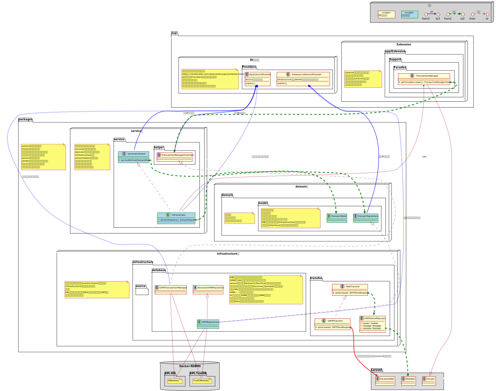
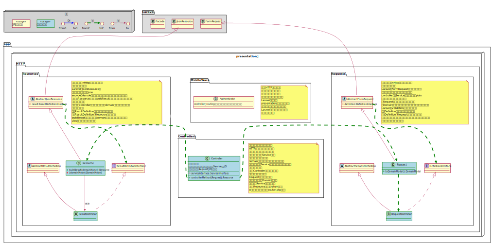
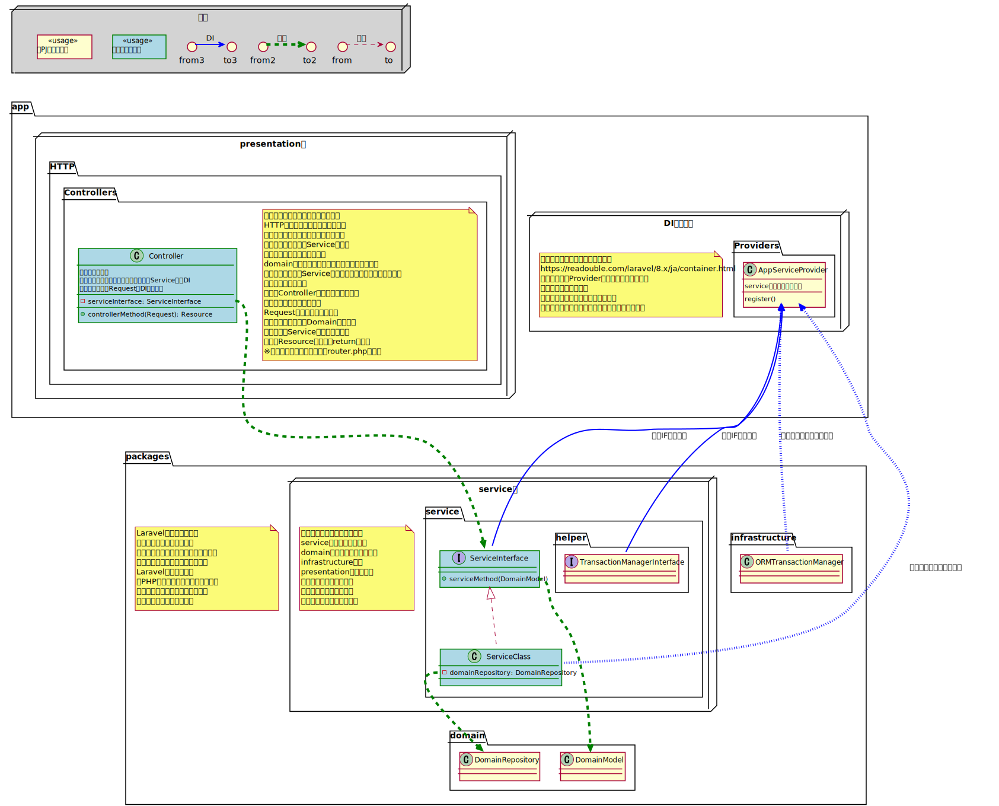

# 設計思想詳細
本PJでは戦略的ドメイン駆動開発をするためにLaravelを使ったクリーンアーキテクトを取り入れており  
Laravelそれ自体のドキュメントを読みながら一からクリーンアーキテクトを実践するとコストがかかりがちな部分を予め用意しております。  
したがって、Laravelとはまた違った実装上の決まり事や思想が注入されており、ここではそれらについて解説していきます。

## packagesについて
本PJのディレクトリ構造をみていただくと、Laravelとして用意しているビジネスロジックの実装箇所である
app
というディレクトリと同列に  
packages  
というディレクトリが存在することがわかると思います。
このpackagesというディレクトリに下記3つのディレクトリが配置されています。

    domain
    infrastructure
    service
上記3つのディレクトリをそれぞれレイヤーとし、それぞれに対して責務与えています。

    domainレイヤ::業務ロジックを定ぐ
    infrastructureレイヤ::外部リソース操作を定義する
    service::実現したい機能を定義する

このうち

    infrastructure
などを例にとると想像しやすいかと思いますが、DBに対する操作、外部との連携、メール送信
等の責務を任せるようにします。  

また3つの層が互いに疎結合であるべきで、かつ他のレイヤの責務が混じらないように設計する必要があります。  
※ただし大前提としてLaravelを使用していることもあり、その縛りによって厳しい部分も多く完全には実現できてはいません

わかり安い例でいうとdomain層にはビジネスロジックを任せていくことになりますが、  
その時domain層の中にDBに関する関心事、例えばselect句のようなsql構文を直接書  
いてしまわないように心がけて設計することで実現できます。

## Laravelとpackagesについて
ここまででpackagesディレクトリの大まかな役割を説明してきました  
今度はLaravel本体はどのような役割を持つかについて解説していきます  
packagesでは、主にアプリケーションを構成する中身についての定義を  
していくことになりますが これだけではアプリケーションは動作しません。  
アプリケーションを使用するためのインターフェースが必要です。  
本PJではデフォルトでLaravelをApi専用で使用しているのでWebApi  
を例に出すとpackagesでは、エンドポイントの定義、ルーティング、  
HTTPリクエストに基づいたコントロールについての定義がありません。  
一般的に言われるcleanArchitectにおいて上記は

    presentation
というレイヤに分類されます。  
Laravelから提供される機能はこのpresentation層の定義に強力な力  
を発揮できるものが多々あります。よってpresentation層に関しては   
Laravelにべったりと寄り添った実装をしていきます。

また、Laravelは強力なDIコンテナの機能も提供しています。  
これは
- domain層とinfrastructure層の依存性を解決
- service層から直接infrastructure層を参照しない仕組の構築
- laravelが予め定義しているHash機能
- laravelが予め定義している認証機能の拡張
- controller層から参照するservice層の可用性の担保
  
などなどをシステムを構築する上で重要な役割をになっております。  
大きくは上記を抑えておけば、これから開発するアプリケーションについて、  
何のドキュメントを見ながら、どこにどのように定義していけばよいのか。  
が見えてくるかと思います。

## メール、DB、外部APIについてそれぞれ最終的にはLaravelFWの機能を使っているのでそれについて言及します。
実装者としては上記を意識せずに、クリーンな実装を心がければよいという仕組にしております。

