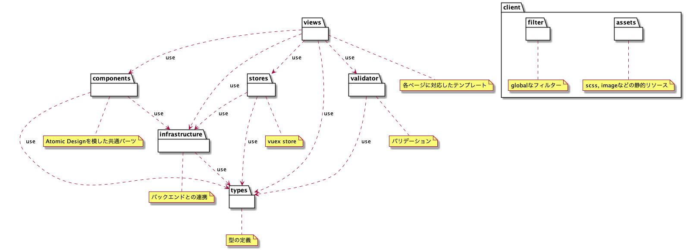

# SimpleVueCli

- [npm](https://docs.npmjs.com/)

# SetUp
## git clone
まずはこのPJをGitClone、または一括でDLしてください
### cloneの場合
	git clone https://github.com/yuichi-sano/simple-vue-cli
	# 他のPJで使う場合は下記のようにgit管理を削除
	rm -rf .git

### DLの場合
	wget https://github.com/yuichi-sano/simple-vue-cli/archive/refs/heads/master.zip a.zip; unzip a.zip


## Usage

- npmコマンドよりから起動、静的解析、ビルドを実行します。

### setup
```
npm install
```

### run
```
npm run serve
```

- http://localhost:18080 で起動します。

#### mock mode

- バックエンドのAPIの代わりにMockからデータを取得します。
- ルートに`.env.development.local`を作成し、`VUE_APP_USE_MOCK=true`にした後に起動してください。
- `Mock.ts`に定義されているデータを取得するようになります。そのためバックエンドAPIの起動は不要となります。

### lint

```
npm run lint
```

### build
 
```
npm run build
```

/dist配下に静的リソースがbuildされます。

### Reference

- [Vue.js](https://cli.vuejs.org)

## Design

- filter
  - global filterの定義
  - main.tsでfilterを追加
- assets
  - scss, imagesの配置
  - 基本的にはコンテンツチームが生成
- components
  - vueのコンポーネントを定義
  - Atomic Designにて設計
- infrastructure
  - 外部との連携（主にバックエンドのAPI）
- stores
  - 状態管理を定義
- validator
  - 入力チェックなどバリデーションを定義
- types
  - 型の定義
  - どのレイヤーからも定義された型を利用して品質の担保を実現


